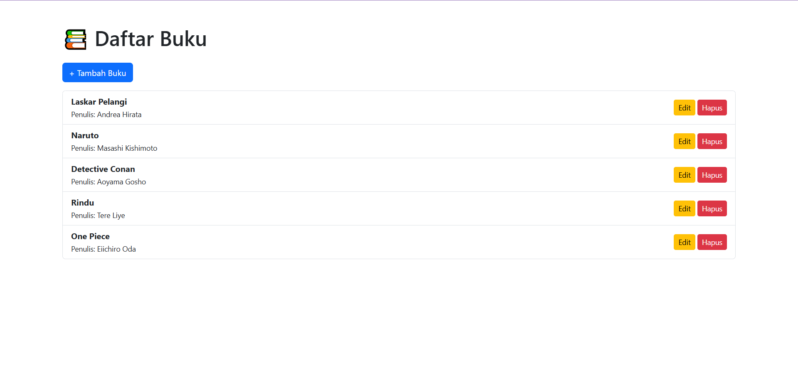

# 📚 Laravel Book CRUD App

This is my first Laravel project – a simple book management app built with Laravel 11. It supports full CRUD operations, soft delete functionality, and responsive UI using Bootstrap.

> ✅ Made with passion while learning Laravel step by step 🚀

---

## ✨ Features

- ✅ Add, view, edit, and delete books
- 🗑️ Soft delete with restore (recycle bin)
- ⚠️ Form validation with error handling
- 💬 Flash success & error messages
- 🎨 Clean UI with Bootstrap 5

---

## 📷 Screenshots




---

## 🚀 Installation

```bash
git clone https://github.com/your-username/laravel-book-crud.git
cd laravel-book-crud

composer install

cp .env.example .env
php artisan key:generate

# Set your DB credentials in .env
php artisan migrate

php artisan serve

```

---

## ⚒️ Built With

- Laravel 11
- PHP 8.3+
- Bootstrap 5
- MySQL / MariaDB

---

## 💡 What I Learned (Output of This Project)

During this project, I learned and practiced:
- Understanding the MVC (Model-View-Controller) architecture in Laravel
- How to build full CRUD features using Laravel routes, controllers, and Blade
- Working with form validation, soft deletes, and flash messages
- Structuring UI with Bootstrap for better user experience
- Using Laravel's migration, Eloquent ORM, and artisan CLI
- Implementing unit testing for form submission and validation (PHPUnit)
- Managing Laravel project with Git & pushing to GitHub

This project marked my transition from static HTML/CSS to dynamic full-stack development using Laravel 🎉


